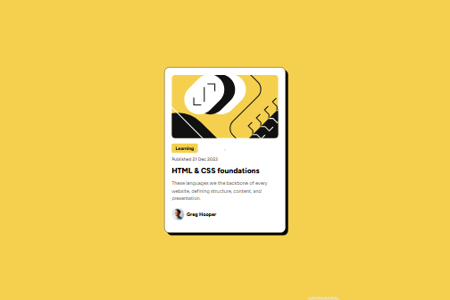

# Frontend Mentor - Blog preview card solution

This is a solution to the [Blog preview card challenge on Frontend Mentor](https://www.frontendmentor.io/challenges/blog-preview-card-ckPaj01IcS). Frontend Mentor challenges help you improve your coding skills by building realistic projects.

## Table of contents

- [Overview](#overview)
  - [The challenge](#the-challenge)
  - [Screenshot](#screenshot)
  - [Links](#links)
- [My Process](#my-process)
  - [Built with](#built-with)
  - [What I learned](#what-i-learned)
  - [Useful resources](#useful-resources)
- [Author](#author)
- [Acknowledgments](#acknowledgments)

## Overview

### The challenge

Users should be able to:

- See hover and focus states for all interactive elements on the page

### Screenshot



### Links

- Solution URL: [Github Repo](http://github.com/Onenne1/frontend-mentor-blog-preview-card)
- Live Site URL: [Github Pages](https://onenne1.github.io/frontend-mentor-blog-preview-card/)

## My Process

### Built with

- Semantic HTML5 markup
- Flexbox
- Mobile-first workflow

### What I learned

The use of the box-shadow property

```css
.card {
  box-shadow: 8px 8px #000201;
}
```

### Useful resources

- [Mozilla Development Network](https://www.mdn.com)

## Author

- Frontend Mentor - [@Onenne1](https://www.frontendmentor.io/profile/Onenne1)

## Acknowledgments

To my Big Bro who kept on encouarging me to do better.
